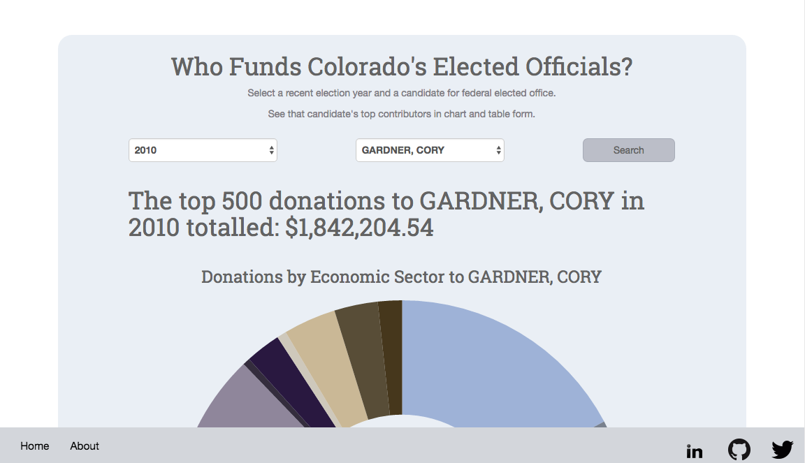
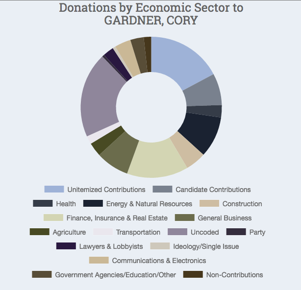
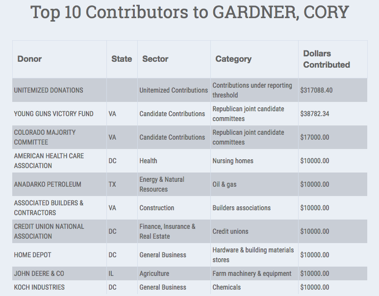

# Colorado Political Funding
## The funding behind Colorado's federally elected politicians 

##About
This site queries the Follow The Money API to display data about Colorado's elected officials. It displays the total amount of dollars from the top 500 records at the top. It also diplays a chart of the donations to each politician by economic sector using the Chart.js library to display the data. 

It also displays a table of the top 10 highest donations for each candidate. 

In the future I plan to add more charts that incorporate additional analysis and potentially the ability to compare opposing candidates. 
